# Hurricane Center Computer Vision Project
A tool to mark the "best track center" and intensity prediction of a hurricane from satellite images using various satellite products alongside in situ measurements.
NOTE: The terms "hurricane", "typhoon", and "tropical cyclone" refer to the storms in different areas of the globe.  For simplicity, the term "hurricane" is used throughout, though often "tropical cyclone" or "TC" is used to refer to the same weather phenomena.
## Part 1 - Conceptual design

### Problem description

In general, tropical cyclones are storms that involve rotating low-pressure weather systems without any "fronts" (air masses with different densities). They are named and classified in their intensities by the maximum sustained windspeeds and the location of their formation. Hurricanes, for example, are ones that form in the Atlantic basin, eastern or central North Pacific Ocean and that have a sustained windspeed of 74mph or greater [National Ocean Surface](https://oceanservice.noaa.gov/facts/hurricane.html).  With the availability of satellite imaging, experts can use the Dvorak method to classify the intensity, growth, and decay of tropical cyclones using a variety of visual classification techniques [Tropical cyclone intensity analysis using satellite data](https://repository.library.noaa.gov/view/noaa/19322) often at a temporal resolution of 2 minutes or less [[Do et al](doi.org/10.1038/s41598-025-12733-w)].    

### Conceptual questions and learning
What will I need to learn to solve the problem?
I will need to take the satellite image and have the algorithm learn where the centers are placed.  I think this should be the most straightforward task. Then, using the aforementioned Dvorak method, the shape might also be classified which gives more insight into the intensity and growth or decay of the tropical cyclone. Therefore, this could be similar to "face recognition problems" where specific shapes and features are emblematic of specific identities.
Do you need to detect the object (i.e., tell where it is) in the frame?
This is a good question that I do not know the answer to yet exactly - depending on where the hurricane is in the image, it may be clear that it is in a central location (some satellite images are already centered at the hurricane much like a headshot of a person). Others may be in a bigger view and so having a sense of where it is would be important.
If so, is there anything specific about the object you are detecting you would like to use (e.g., color, shape, “key points” that are very specific to that object, etc.)? 
I will be using data that has images in a variety of bands or wavelengths of light. This may help increase or decrease the reliability of the image predictions, or it may be extraneous, unnecessary information like the color channels of face images as we talked about in class. 
What kind of features you think would be needed to calculate, and which image properties your solution should be agnostic to?
I will also attempt to incorporate the background, in-situ data that can give some baseline truth that may help extract more information from the images.

### Data sources

#### Satellite

The data will be sourced from satellite images from NOAA GOES-R Series Advanced Baseline Imager (ABI) Level 1b Radiances which have 16 channels of near-infrared and infrared bands.
[NOAA GOES](https://www.ncei.noaa.gov/access/metadata/landing-page/bin/iso?id=gov.noaa.ncdc:C01501). 

#### Dropsondes

Dropsondes are small, cylindrical measurement tools that are released from airplanes that fly over and in the hurricane to collect a variety of measurements including windspeed, wind direction, relative humidity, and pressure among other things. These are often used "operationally" to classify and categorize the various aspects of a hurricane.  
[Dropsonde data](https://www.aoml.noaa.gov/hrd/data_sub/dropsonde.html)

#### Sea Surface Temperature Data

Sea surface temperature, along with the related ocean heat content, are thought to be an important aspect of the fueling of hurricanes. There are a variety of products that are used to extract this information, including drifters, gliders, XBTs, and buoys [NOAA Hurricane data](https://www.aoml.noaa.gov/data-products/#hurricanedata) 

## Part 2 - Data acquisition and preparation
Prepare a short description of a database that you acquired (no need to upload an actual database into GitHub or Google Drive). Push the report (under "Part 2" section in your readme.md) to your semester project repo by the deadline. Include these elements into your report:

### Source (download link and associated paper(s) offering the dataset(s))
The tropical cyclone (named typhoon because of the location in the Northwester Pacific Basin, hereto referred as TC). The paper is located at [Multi-heat keypoint incorporation in deep learning model to tropical cyclone centering and intensity classifying from geostationary satellite images](https://www.nature.com/articles/s41598-025-12733-w) after making contact with authors Dr. Thanh-Ha Do, and Dr. Duc-Tien Du. They sent an email link that was used to download a zip file which had the following pieces, a folder containing the following
This is a satellite dataset covering the period 2015–2023, using the IR1 spectral channel, resized to 625×500 pixels in PNG format:
0) The label information in the CSV format
1) for the geographical region: 
 biendong_startlat = -4.99
 biendong_startlon = 90.01
 biendong_endlat   = 34.99
 biendong_endlon   = 134.49
2) The dataset includes labels for several storm grades based on the [RSMC Tokyo best-track data](https://www.jma.go.jp/jma/jma-eng/jma-center/rsmc-hp-pub-eg/besttrack.html), which is also processed and attached in this mail. 
3) The original satellite data were obtained from [Chiba University, Japan](https://www.cr.chiba-u.jp/databases/GEO/H8_9/FD/index_en_V20190123.html). 

### Differences between the train and validation subsets, which are important from your project point of view
There are two strategies that I may use given the size and scope of this data set, the first is to simply use a random split of 60%-20%-20% for the data, which will hopefully ensure an ability for the model to categorize the location of the center of the TC at any point. Another would be to organize them by storm and use successive snapshots of the hurricane together. This relates to Adam's suggestion of adding in a temporal aspect to the computer vision algorithm.  With regards to time, the first will be tried to see a bulk estimation of the algorithm's effect, and then the use of individual tracks taken together will also be assessed.

### Number of distinct objects/subjects represented in the data, and number of samples per object/subject
This data set has 3,945 individual objects as images of a particular time from a satellite of a TC in the East Sea.  There are, as far as is evident, only one TC per image, with a corresponding best track location in latitude and longitude as well as a labeled bounding box of the center and a labeling of intensity. The first task of this project will be to recreate the storm center location, and then if given time, the intensity will also be predicted.

### Brief characterization of samples: resolution, sensors used, illumination wavelength, ambient conditions
As stated above, this data set uses the IR1 spectral channel, resized to 625×500 pixels in PNG format for the geographical region of the Biển Đông (East Sea, also known as the South China Sea). Since this is a static view of the sea that contains the TCs, it can be used easily for comparison across the different images.

## Part 3 - First Update 
### Methods already applied

After cleaning and organizing the data (and the fact that it took longer to get the ground truth labels working), two simple models were used.  The first was a simple YOLO (You Only Look Once) version model using the first YOLO version architecture with just 3 epochs to debug, then an improvement to that model using the pretrained backbone version 2 as well as by running it longer, and then a Kalman filter was also applied to the model to predict the direction of the hurricane in the successive frames.

(Part 3A, YOLO) 
The script trains a compact, single-object variant of a YOLO-style detector. Each image contains one storm center, supplied through bounding boxes in a CSV file. The data loader reads each image, resizes it to a fixed resolution, and converts the bounding box into a YOLO-style grid target. The image is divided into an S×S grid; the cell containing the storm center receives an objectness flag plus normalized box parameters. All other cells indicate no object.

A lightweight MobileNetV2 backbone extracts convolutional features. These features are adaptively pooled to an S×S spatial map. A final 1×1 convolution produces five values per cell: objectness, center offsets, and normalized width and height. Sigmoid activations constrain outputs to usable ranges. The loss function combines objectness loss (penalizing false positives and false negatives) with a coordinate regression loss applied only to the true object cell.

Training proceeds over randomly split train/validation/test groups, with performance evaluated by IoU, center-distance error, and IoU-50 recall. During inference, the model selects the cell with the highest objectness score and decodes its box prediction back to image coordinates. The approach essentially mimics YOLOv1 behavior but simplified to the single-object case, enabling focused storm-center localization.

(Part 3B, YOLO and Kalman filter)
The TinyYOLO-based model above produces single-frame bounding-box estimates, including the center coordinates (cx, cy), width, height, and an objectness score for a detected storm. Each prediction is independent and inherently noisy due to factors such as illumination changes, cloud morphology, and background texture. Storms observed by satellite can drift smoothly, but the detector output may jump slightly from frame to frame because convolutional networks do not enforce temporal consistency. A Kalman filter addresses this missing temporal structure by integrating predictions over time.

In this context, the Kalman filter defines a state vector that can include position, velocity, and size, typically [cx, cy, vx, vy, w, h]^T. The prediction step uses a constant-velocity model to forecast the storm’s next location, producing a smooth estimate of where it should appear in the next frame. The detector output serves as a noisy measurement, and the Kalman equations blend the predicted state with the measured state according to their uncertainties. High detector confidence moves the estimate closer to the measurement, while low confidence retains proximity to the prediction.

### Justification for using these methods
(Part 3A, YOLO)
A compact, single-object detector is well suited for storm-center localization, and the structure of this code reflects choices that match the problem’s constraints. Each image contains only one target, allowing the training pipeline to remove the overhead of anchors, multi-scale heads, and post-processing steps designed for crowded scenes. This reduces model complexity and lowers the computational load, which is important when large satellite archives must be processed efficiently. A grid-based formulation enforces a consistent spatial representation, giving the network a stable way to associate each storm center with a single responsible cell. This structure encourages learning of coarse global geometry rather than relying on many overlapping proposals.

The use of a MobileNetV2 backbone provides strong feature extraction while keeping parameters light, enabling fast training even on modest hardware. The custom loss balances objectness and coordinate accuracy, ensuring that false detections are discouraged and that precise center estimates are rewarded. The data-splitting routine, evaluation metrics, and checkpointing logic create a transparent and reproducible workflow that tracks genuine improvements rather than noise. The simplified predictor, combined with explicit IoU and distance-based validation, offers a controllable and interpretable model whose behavior aligns with meteorological use cases requiring stable, frame-level localization rather than full general-purpose detection.

(Part 3B, YOLO and Kalman filter)
The Kalman filter improves temporal stability by smoothing center trajectories, stabilizing size estimates, interpolating across missing frames, and rejecting outlier bounding boxes. While the YOLO model handles per-frame spatial localization, the Kalman filter ensures temporal consistency, producing a continuous and physically plausible storm track from otherwise noisy frame-by-frame predictions.

### Sample illustrations showing how methods processed training data
(Part 3A, YOLO)
Here are a sample of the results of the first model 

  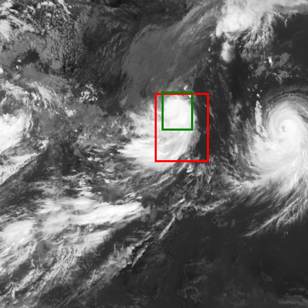
  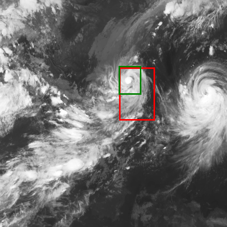
  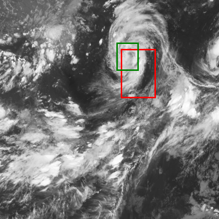
  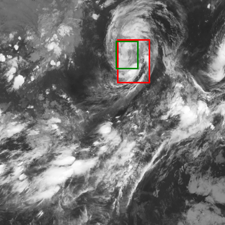
  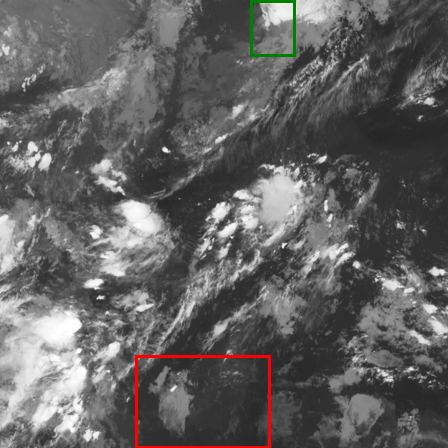
  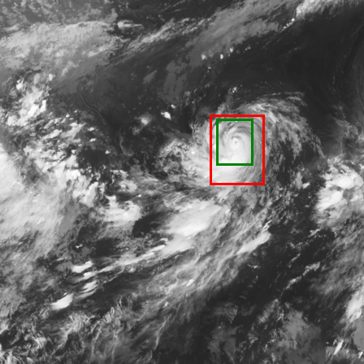
  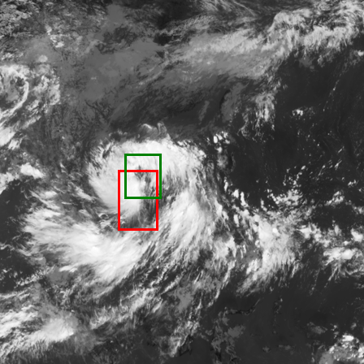
  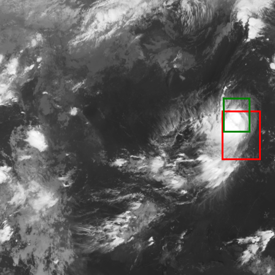
  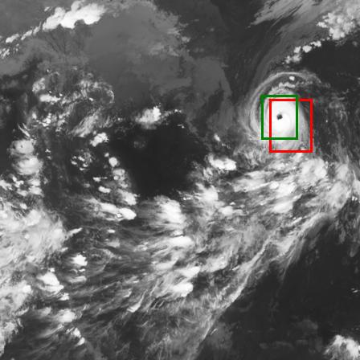
  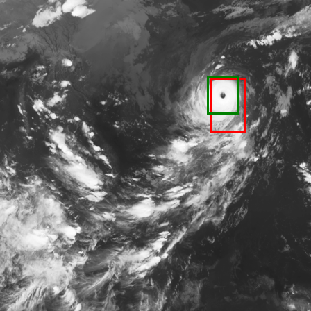
  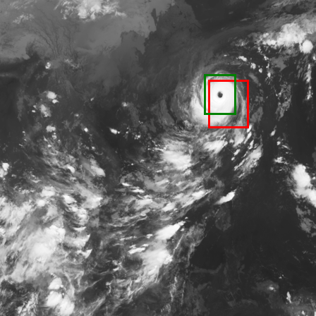
  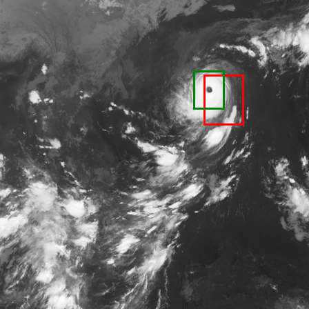
  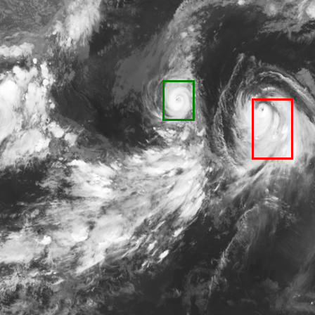
  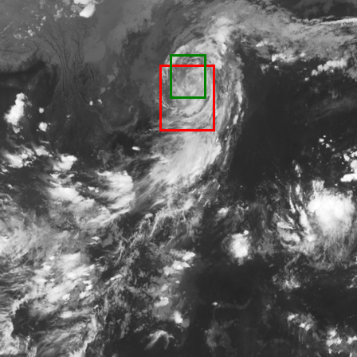
  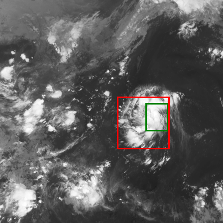
  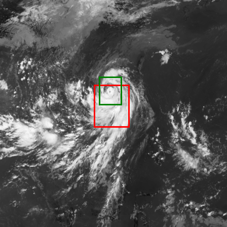
  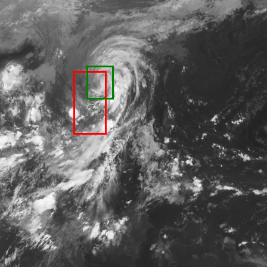
  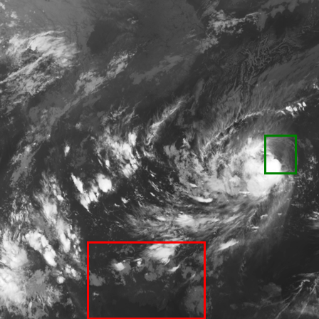
  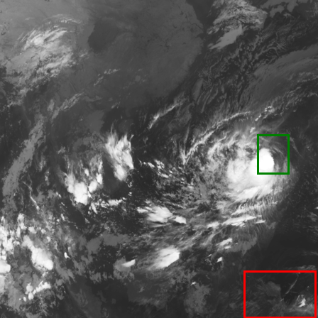
  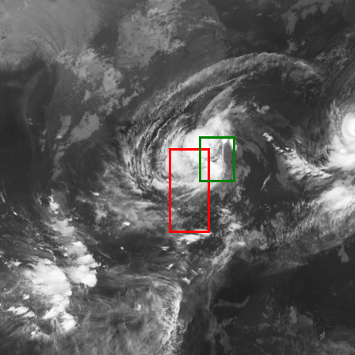
  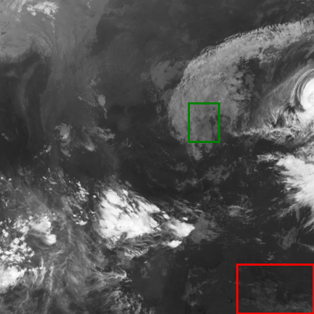
  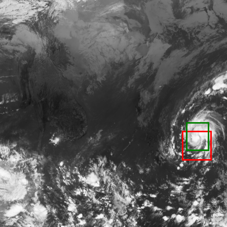
  
  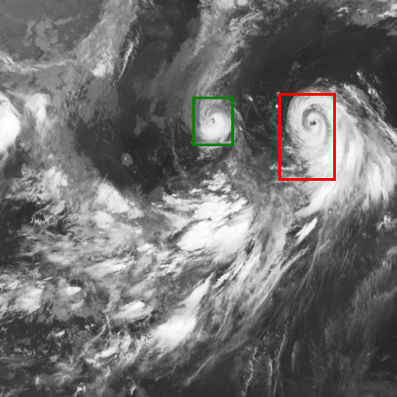

  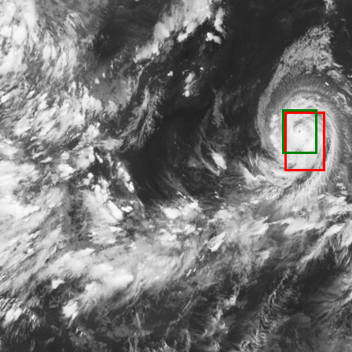
  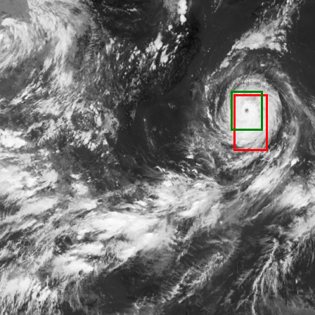
  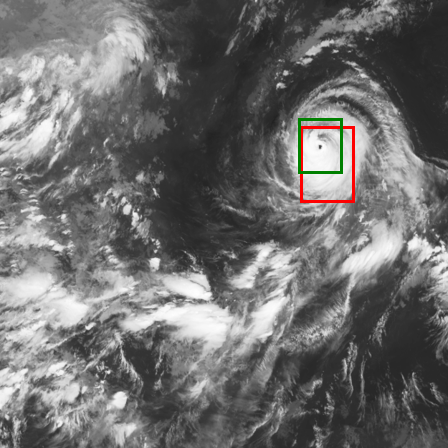

(Part 3B, YOLO and Kalman filter)
This is an illustration of the code for the YOLO along with the Kalman filter. Note the best track dot prediction generated by the model using the previous states. 

  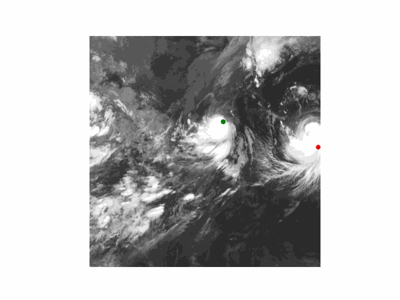
  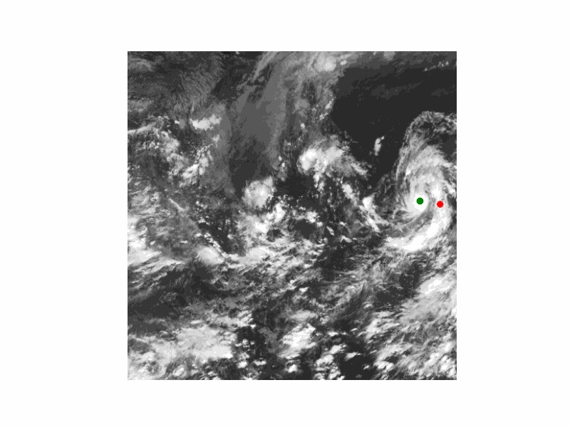
  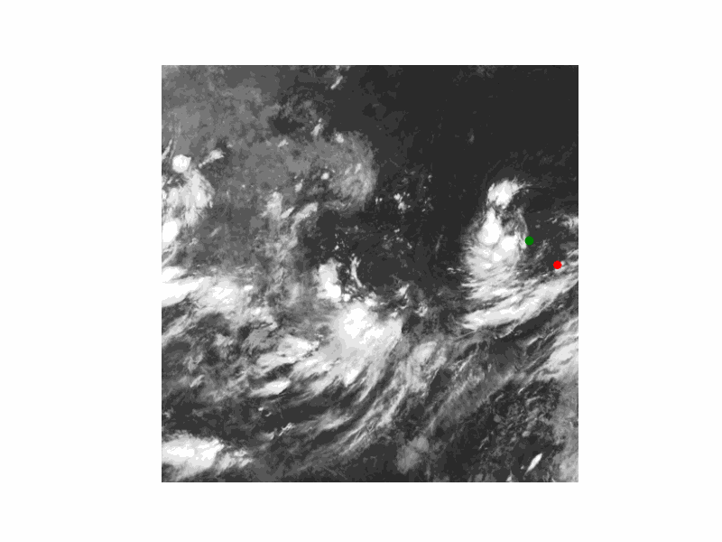

### Code summary and instructions for running example
(Part 3A, YOLO)
To run the test code, cd into the part_3_code_example_single_object_yolo folder and use python3 to run the file run_on_sample_subset.py, which uses the best_tiny_yolo_single.pth to execute on the training_and_testing_samples which has 30 examples.

(Part 3B, YOLO and Kalman filter)
To run the test code, cd into the part_3_code_example_kalman_filter folder and use python3 to run the file run_on_sample_subset_kalman.py, which uses the best_tiny_yolo_single.pth to execute on the training_and_testing_samples which has 3 images from sample storms and returns a gif file that shows the predictions.

Note: Part 3 composed with the assistance of ChatGPT System using model 5.0, link provided to prompt run here: [Prompt](https://chatgpt.com/share/6936f083-7f64-8007-98f6-db3692725bce)

## Part 4 - Final solution
### Justification of the choice of classifier
In this final solution, a few changes were made in order to help fine tune and achieve greater accuracy with the model.  A major one was the images that formed a smaller selection for the training in this round. The original size of the database used in training was 3,945 images. After filtering for the ones that had the proper best track information as to the hurricane's location on the image, 2,915 images remained.  After discussing with Adam and looking at a number of the images, it was decided to select only a smaller subset of the images that better represented the hurricanes that are "mature", that is, have the look of a typical hurricane with a spiral pattern and a well defined eye center. These were classified by hand by me (although, as I will discuss later, there is metadata in the labels of the image names that uses more standard metrics that could help subset the images). After choosing these images, there were 691 images that were used to train the various models.
The first was the same simple YOLO (MobileNetV2, which I will call YOLO_v2) with the Kalman filter used in the previous section, section 3B.  I also tried a few more classifiers as well, including a simple multilayer perceptron with a linear layer, ReLU activation function, and dropout layer. Both were run for 20 epochs, and reasonable convergence of the loss functions were achieved.
An attempt at the newest model of YOLO, (version 8), using a similar structure to the lightweight as well as a DINOv2 model, both without Kalman filters was made, but I was not able to debug the training in time due to the size of those models (both in structure and the large weights that were required to be downloaded).

### Classification accuracy achieved on the training and validation subsets
The following are the loss functions for the YOLO_v2 and the MLP versions of the classifier.

#### YOLO_v2

  

#### MLP

  

### Short commentary related to the observed accuracy and ideas for improvements
There while the accuracy of the training and testing of both models did shrink rapidly, the ability of the models to accurately predict the centers in the images was very minimal, as can be seen in this selection of the images.

  
  
  
  
  

### Instructions how to run example code
For the MLP, download the weights from the Google drive link [here](https://drive.google.com/file/d/1O7ko1iF_esuEihmELitYx8XlbHuXf-YX/view?usp=sharing) into the part_4_code_example\part_4_mlp folder of this repo. Then, cd into the that directory and run the infer_from_model.py. It should use the selected images to generate the images with the ground truth and the prediction (similar to the ones shown above).

## Part 5 - Final update
### Description of the test database you collected or downloaded
After training the above in the different parts, I was using a "test set" that was derived from the original dataset provided by the authors of the [paper by Dr. Thanh-Ha Do, and Dr. Duc-Tien Du](https://www.nature.com/articles/s41598-025-12733-w), using a 80-20-20% train, validation, test split. In addition, I included approximately ______ images of a different hurricane satellite imagery from a single hurricane, Hurricane Erin, from 2025, that my research group is studying more intensely after a coordinated field campaign that launched a large variety of measurement instruments before, during, and after its passage close to Florida. The satellite images for this part were collected from the [Geostationary Operational Environmental Satellites (GOES)-R Series](https://www.ncei.noaa.gov/products/satellite/goes-r) and were downloaded, extracted, and organized by me using code that I hope to be able to share publically to better facilitate the use of the images for similar projects. The test data set is very different than the one used for training and validation for a variety of reasons. First, there are in entirely different hemispheres of the globe. Though there are in very different areas, their structures and movements are very much related. The images can be seen to be very similar therefore, and using them to test my final programs is a good use case, because the inspiration of this project was to have a way to use the trained computer vision system to predict the center of the hurricane in an image that is pulled from the GOES Satellites. These images are taken and uploaded at approximately every 10 minutes, and so it could be a useful way to find the centers quickly in an live situation.

### Classification accuracy achieved on the test set

### Reasons for solution performance 
Images and best track were taken every 6 hours
Different shapes and other aspects (Central pressure, maximum sustained wind speed, radius of maximal wind speed, Direction of the longest radius of 50kt winds or greater,	he longest radius of 50kt winds or greater,	the shortest radius of 50kt winds or greater,	direction of the longest radius of 30kt winds or greater,	the longest radius of 30kt winds or greater,	the shortest radius of 30kt winds or greater
)
### Possible improvements to lower observed error rates

The aim of this last part of the semester project is to test your solutions on unknown data. By "unknown data" I mean a sequestered set of samples, not used (or seen) when you were designing your method in previous phases.

As your final deliverable submit a report (no page limit, but try to be concise; 1000-2000 words should suffice) as a separate (from Parts 1, 2, 3 and 4) section of the readme.md in your GitHub that includes:

Description of the test database you collected or downloaded: What is the size of the database? What is different when compared to the training and validation subsets? Why you believe these differences are sufficient to test your final programs? (1 points)
A classification accuracy achieved on the test set. Use the same metrics as in previous phase. (1 points)
Most of you should see worse results on the test set when compared to the results obtained on train/validation sets. You should not be worried about that, but please provide the reasons why your solution performs worse (with a few illustrations, such as pictures or videos, what went wrong). What improvements would you propose to lower the observed error rates? (3 points)
